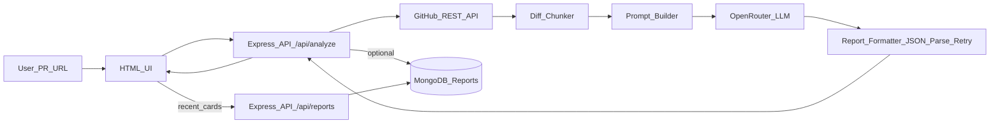

# Sentry — AI-Powered GitHub PR Reviewer

Sentry is an API + lightweight HTML UI that reviews public (and optionally private) GitHub Pull Requests.
You paste a PR URL, Sentry fetches the PR context from GitHub (metadata, files/diffs, commits, comments, reviews), sends it to an LLM via OpenRouter, and returns a **structured JSON merge-readiness report**. Reports can also be persisted in MongoDB and shown as **recent report cards** on the home page.

## UI Preview


## What you get

- **UI**: `http://localhost:4020/` (submit PR URL + view recent reports)
- **API**:
  - `POST /api/analyze` — analyze a GitHub PR URL
  - `GET /api/health` — health check
  - `GET /api/reports` — recent persisted reports (MongoDB)

---

## Architecture

End-to-end flow:



Key modules:

- `api/index.js`: Express serverless app (serves `public/` + mounts API routes)
- `api/routes/analyze.js`: orchestrates GitHub fetch → chunk → prompt → LLM → parse → response (+ optional DB save)
- `lib/github.js`: GitHub REST client (pagination + rate limit handling)
- `lib/chunker.js`: keeps diffs within context limits (prioritizes non-test files, truncates huge patches)
- `lib/openrouter.js`: OpenRouter client (60s timeout + retry-on-5xx)
- `lib/report-formatter.js`: parses strict JSON and retries once if invalid
- `lib/mongo.js` + `lib/report-store.js`: MongoDB persistence for reports

---

## Environment variables

Create a `.env` file in the project root:

```bash
OPENROUTER_API_KEY=your_openrouter_key
GITHUB_TOKEN=optional_github_token
DEFAULT_MODEL=anthropic/claude-sonnet-4
MONGODB_URI=mongodb://127.0.0.1:27017/sentry
```

Notes:
- `GITHUB_TOKEN` is optional but recommended to avoid GitHub rate limiting.
- `MONGODB_URI` is optional. If missing, `/api/reports` will return an empty list with a warning and the app will still work.

---

## Local installation (manual)

### Prerequisites
- Node.js **18+** (recommended: Node 20)
- (Optional) MongoDB running locally if you want persistence

### Install

```bash
npm install
```

### Run

```bash
npm start
```

Open:
- UI: `http://localhost:4020/`
- Health: `http://localhost:4020/api/health`

### MongoDB (optional)

If you want to store and display recent reports, ensure MongoDB is running and set:

```bash
MONGODB_URI=mongodb://127.0.0.1:27017/sentry
```

---

## Local installation (Docker)

### Option A: Docker Compose (recommended)

This runs **MongoDB + the app** together.

1) Create `.env` (same format as above).
2) Start:

```bash
docker compose up --build
```

Open:
- `http://localhost:4020/`

### Option B: Dockerfile only

Build:

```bash
docker build -t sentry .
```

Run (no MongoDB persistence in this mode unless you also provide a reachable `MONGODB_URI`):

```bash
docker run --rm -p 4020:4020 \
  -e OPENROUTER_API_KEY="$OPENROUTER_API_KEY" \
  -e GITHUB_TOKEN="$GITHUB_TOKEN" \
  -e DEFAULT_MODEL="$DEFAULT_MODEL" \
  -e MONGODB_URI="$MONGODB_URI" \
  sentry
```

---

## API usage

### `POST /api/analyze`

Request:

```json
{
  "prUrl": "https://github.com/owner/repo/pull/123",
  "githubToken": "optional",
  "model": "optional"
}
```

Response (success envelope):

```json
{
  "success": true,
  "pr": { "url": "...", "title": "...", "author": "..." },
  "report": {
    "verdict": "APPROVE",
    "confidence": 0.9,
    "summary": "...",
    "risks": [],
    "strengths": [],
    "missingTests": [],
    "securityConcerns": [],
    "performanceNotes": [],
    "unresolvedDiscussions": [],
    "mergeReadiness": { "ready": true, "blockers": [], "suggestions": [] }
  },
  "metadata": {
    "model": "anthropic/claude-sonnet-4",
    "filesAnalyzed": 12,
    "totalChanges": "+340 -120",
    "analyzedAt": "2026-05-07T10:30:00Z"
  }
}
```

Error shape:

```json
{
  "success": false,
  "error": { "code": "GITHUB_RATE_LIMITED", "message": "..." }
}
```

---

## Design system

UI styling is based on `DESIGN.md` (warm cream canvas, coral CTAs, serif display typography, dark product surfaces). The implementation uses CSS custom properties in `public/styles.css`.

